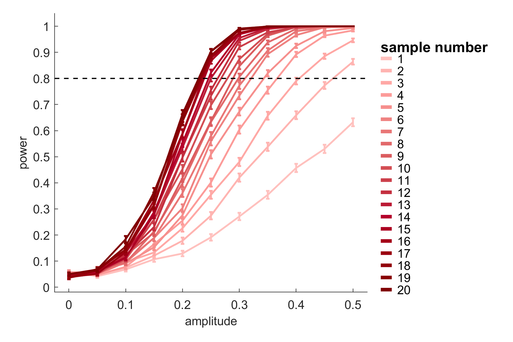
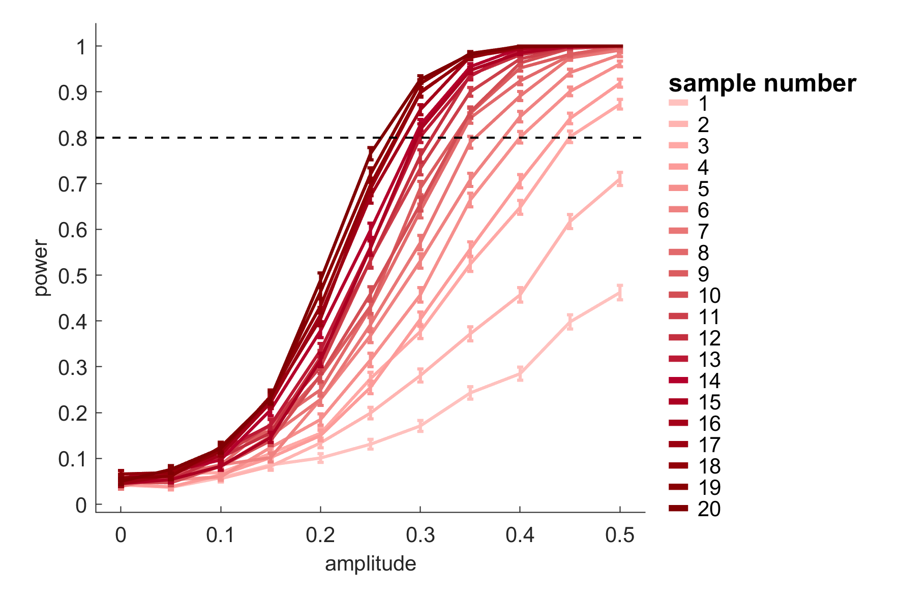
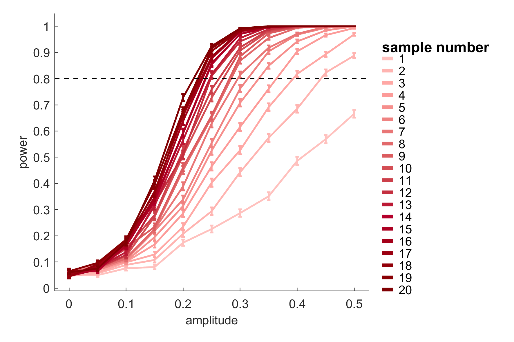
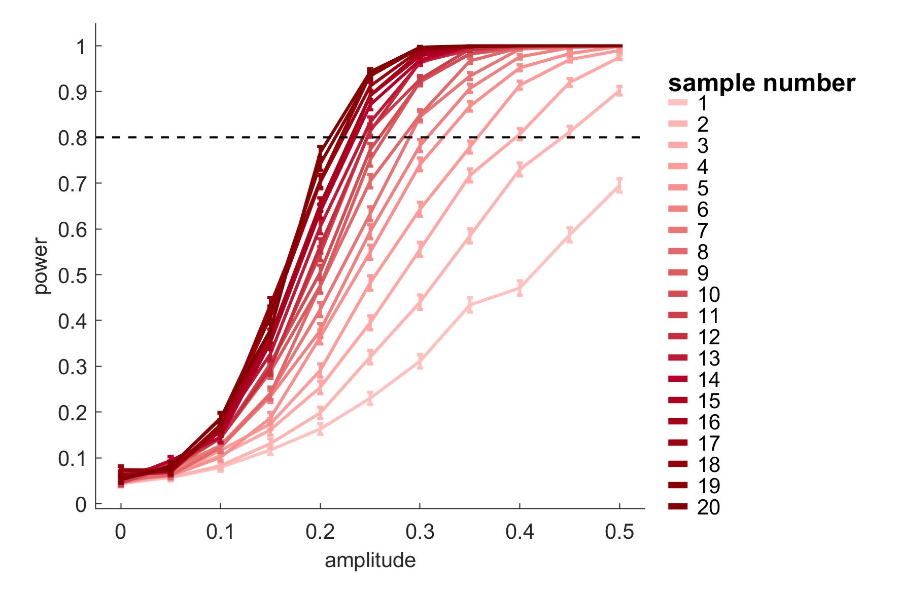
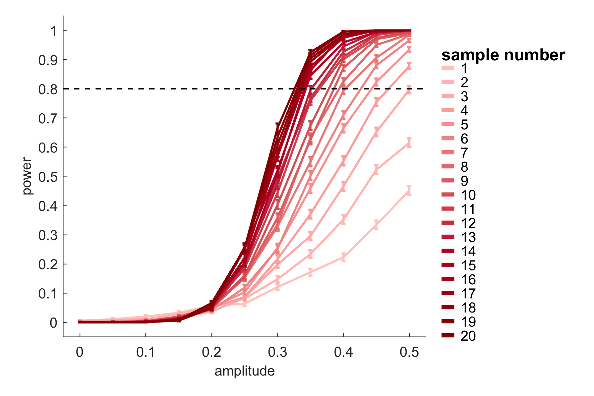

# chi-square-test-of-power-spectrum
 Use chi-square distribution to test the psd

## How to use

This test is easy to do. One could find a simple demo in the power analysis of this test in *power_of_xxxtest*.  Though I didn't give a separate function of this test, one could easily use the $\chi^2$ related function, such as *chi2cdf*, *chi2pdf*, *chi2inv* in MATLAB, to design a test of the specific hypothesis. 

The following introduction would help. 


## A method to test periodicity by power spectrum

### $\chi^2$ test of the power at single frequency

Suppose a time series $\{X_t\}$ is of a white noise process with zero mean, $X_t\sim N(0,\sigma_0^2),i.i.d$. With limited samples $t=1,2,...,T$, the total energy of this series would be 
$$E=\sum_tX_t^2$$
This gives
$$\frac{E}{\sigma_0^2}=\sum_t(\frac{X_t}{\sigma_0})^2\sim\chi^2_T \tag{1}$$
Let $\{E_f\}$ be the energy spectrum of this time series. Nyquist sampling theorem gives totally $F=\frac{T}{2}$ independent frequencies which could be estimated. For a specific frequency $f$, a white noise process gives uniformly random initial phase and random energy following $\chi^2_2$. Consider the expression at complex plane, the real part $R_f$ and the imaginary part $I_f$ of the initial state $V_f$ are both following $N(0,\sigma_f^2)$. Then,
$$\frac{E_f}{\sigma_f^2}= \frac{\vert V_f\vert^2}{\sigma_f^2}=(\frac{R_f}{\sigma_f})^2+  (\frac{I_f}{\sigma_f})^2\sim\chi^2_2\tag2$$
Because of the independence of the Nyquist frequencies and the evenly distributed power of the white noise process, $i.e.\sigma_1=\sigma_2=...=\sigma_f=\sigma$, 
$$\sum_f\frac{E_f}{\sigma^2}\sim\chi^2_{2F}=\chi^2_T\tag{3}$$
Notice $(3)$ and $(1)$ give the similar results.
Let $\theta=\sigma^2$. Now we consider a process with a different $\theta_f$ at specific frequency. Again we have
$$\frac{E_f}{\theta_f}\sim\chi^2_2\tag4$$
Consider the PDF of $\chi^2_k$
$$f(x;k)=\frac{1}{x^{k/2}\Gamma{(k/2)}}x^{\frac{k}{2}-1}e^{-\frac{x}{2}}$$
Let $y=\theta x$, then naturally we generalize that distribution
$$f(y;k,\theta)=\frac{1}{2^{k/2}\Gamma{(k/2)}}(\frac{y}{\theta})^{\frac{k}{2}-1}e^{-\frac{y}{2\theta}} $$
and
$$E_f\sim\chi^2(2,\theta_f)\tag5$$
more simply, with $k=2$, the PDF
$$f(y;\theta)=\frac12e^{-\frac{y}{2\theta}}\tag6$$

**A more accurate method would be given further.**

#### test of the absolute power/energy

Now we give the uniformly most powerful test (UMPT) of $\theta_f$.
Suppose we have $N$ subjects with $N$ sampled power of frequency $f$, $\{E_{f,n}\}$. Consider
$$H_0:\theta_f\le\theta_0 \ \ \ \ \ H_1: \theta_f> \theta_0$$
Because $f(x;\theta_f)$ belongs to exponential family, its UMPT exists and will be given by the sufficient statistic.
$$\lambda=\sum_nE_{f,n}$$
With null hypothesis $\theta_f=\theta_0$, we have:
$$\frac{\lambda}{\theta_0}=\sum_n\frac{E_{f,n}}{\theta_0}\sim\chi^2_{2n}\tag7$$
or,
$$\lambda\sim\chi^2(2n,\theta_0)$$
Keeping $\alpha=0.05$, we could test its statistical power and comparing to the widely used permutation test of time series. 

#### test of the ratio of the power/energy

However, practically, $\theta_0$ is unknown. Instead, we would like to test the power proportion $p_f$ with $\sum_f p_f=1$. For example, $p_f$ at specific Nyquist frequency of a $T$ sample time series of white noise is $\frac{2}{T}$ because the number of the Nyquist frequency is $F=\frac{T}{2}$. Consider the random variable of that proportion
$$P_f = \frac{E_f}{\sum_fE_f}$$
Because $(2)$ and $(3)$, 
$$\frac{\theta}{\theta_f}\frac T2P_f=\frac{\theta}{\theta_f}\frac{E_f/2}{\sum_fE_f/T}\sim F(2,T)$$
Here we let $\theta$ be an "average" of $\theta_1,\theta_2,\dots,\theta_f$, which normalize $\sum_fE_f$. Obviously, when $p_f$ is higher, the ratio $r_f=\theta_f/\theta$ should be higher. And when $p_f=2/T$, $r_f=1$. Then we have
$$\frac T2 \frac{P_f}{r_f}\sim F(2,T)$$
which gives the statistic and distribution. 
However, it's difficult to expand it to multiple subjects because we cannot find a sufficient statistic of $r_f$. Also, we cannot give a description of the distribution of sum of multiple random variables following $F$-distribution. However, with the following approximation:
	If $X\sim F(d_1,d_2)$, then $Y=\lim_{d_2\rightarrow \infty}d_1X\sim\chi^2_{d_1}$ 
Suppose $T\rightarrow\infty$, then 
$$\frac{TP_f}{r_f}\sim \chi^2_2\tag8$$
Let $P_{f,n}$ be the proportion of the $N$ subjects, then we have
$$\frac{T}{r_f}\sum_n P_{f,n}\sim \chi^2_{2n}\tag9$$
or, because $F = T/2$, 
$$\frac{2}{r_{f_0}}\sum_n\frac{E_{f_0,n}}{\bar E_{f,n}}\sim\chi^2_{2n}\tag{10}$$
Actually it's the approximation of $(7)$. Practically, $T$ is large enough for this approximation. 

**Note:** Practically, the first frequency and the last frequency given by FFT cannot be summed into $\sum_fE_f$, because they don't follow $\chi^2_2$. 

#### false alarm rate and statistical power of the ratio test

It's easy to find the false alarm rates are always $\alpha$ as $n$ increases, however, suppose $H_1: \theta_f=\theta_1>\theta_0$ are true, we would find the power of this test increases as $n$ increases:

```matlab
for n = 1:100
	x_reject = chi2inv(0.95,2*n);
	theta1 = 2;
	prop(n) = chi2cdf(x_reject/theta1,2*n);
end
```

similarly, if $H_1: \theta_f=\theta_1<\theta_0$

```matlab
for n = 1:100
	x_reject = chi2inv(0.05,2*n);
	theta1 = 0.5;
	prop(n) = 1-chi2cdf(x_reject/theta1,2*n);
end
```

Here I tested with a signal added by a white noise of $X_t\sim N(0,1)$ and a sinusoidal series with multiple possible amplitudes. The length was 60, the length of periodicity was 10 and the phases were randomized uniformly. 1000 iterations were taken to estimate the power of this test on different SNRs. See in *power_of_chi2test.m*.

The results showed good performance of this test with standard false alarm noise at $\alpha=0.05$.



### Permutation test of the power

#### Type 1 permutation test

Widely used permutation test of the power of specific frequency has two types. Here we discuss about the type 1 permutation test first. Suppose we have $N$ subjects with $N$ sampled time series $\{X_{t,n}\}$ and the power spectra $\{E_{f,n}\}$. The test statistic of power at frequency $f$ would be 
$$\lambda=\sum_nE_{f,n}\sim\chi^2(2n,\theta_f)$$
which is the same as the $\chi^2$ test. 
Type I permutation test permutes the time samples first and then separately calculates the estimated powers of the $N$ series which then gives the distribution of $\lambda$ under null hypothesis. The permutation could be considered as randomly generating white noise with the estimated $\hat\theta_f$. More precisely, for one of the sampled series, the $\sigma^2$ is estimated by $\hat\sigma^2_n\sim\chi^2(T,\sigma^2)$. Then the randomly generated power $\tilde E_n\sim\chi^2(2,\hat\theta_n)$, where $\hat\theta_n=\hat\sigma_n^2$. The $\tilde\lambda$ generated:
$$\tilde\lambda = \sum_n\tilde E_n$$
However, we cannot say the exact distribution of $\tilde\lambda$ here because $\hat\theta_n$ are not the same for the $N$ subjects. But we guess when $T\rightarrow\infty,N\rightarrow\infty$, the distribution of $\tilde\lambda$ would be of $\chi^2$. Therefore we suppose it has similar power with the $\chi^2$ test.
However, instead, if we use
$$\tilde\lambda = \sum_n\frac{\tilde E_n}{\hat\theta_n}\sim\chi^2_{2n}$$
we cannot say the distribution of the test statistic of the real data: 
$$\lambda=\sum_n\frac{E_{n}}{\hat\theta_n}$$
Though, one need to notice: **The statistic is the sum of power but not the amplitude.** 

#### Type 2 permutation test

This test is different from the type 1 test by averaging the time series first. Because the phases of each sample might be of different distribution, the power of this test differs. For example, when the phase is fully random with uniform distribution, the averaged time series would be with $\sigma^2/N$, and the statistic
$$\lambda=E\sim\chi^2(2,\frac{\theta_f}{N} )$$
While under the null hypothesis, the random series will be generated by 
$$\frac{\sum_n\hat \sigma_n^2}{N^2}=\frac{\sum_n\hat\theta_n}{N^2}$$
When $N\rightarrow\infty$, it equals to $\theta/N$.
The randomly generated
$$\tilde \lambda=\tilde E\sim\chi^2(2,\frac{\theta}{N})$$
Notice the degree of freedom. We have found the statistical power of $\chi^2$ test increases with larger $n$. The type 2 permutation test doesn't sufficiently use the total freedom therefore has smaller statistic power. 
However, if the phase is not of uniform distribution, for example, the time series is phase-locked, this type 2 test would have stronger power than other tests because the energy at specific frequency is kept during averaging but the energy at other frequency, diminishes. Actually, it may be better to discuss it with the test of the phase. 

### Shape test of the power spectra

Here, we begin with $(8)$. Consider 
$$H_0: p_1=p_2=...=p_f=\frac{2}{T}$$
or says,
$$H_0: r_1=r_2=...=r_f=1$$
we may want to test a specific shape as $H_1$
$$H_1: r_f=S(f)$$
Let $Y_f=TP_f$. 
$$\frac{Y_f}{r_f}\sim\chi^2_2$$
while the distribution could be simplified as
$$f(x)=\frac12e^{-\frac x 2}$$
or we can say $Y_f$ follows 
$$f(y;r_f)=\frac12e^{-\frac{y}{2r_f}}$$
Suppose we have $N$ subjects, giving $Y_{f,n}$. With likelihood ratio test, let
$$\Lambda = \frac{\prod_n\prod_ff(y_{f,n};1)}{\max_{r_f\sim H_1}\prod_n\prod_ff(y_{f,n};r_f)}=e^{\frac12(\min_{r_f}\sum_n\sum_f\frac{y_{f,n}}{r_f}-\sum_n\sum_f{y_{f,n}})}$$
and
$$\lambda = \min_{r_f}\sum_n\sum_f\frac{y_{f,n}}{r_f}-\sum_n\sum_fy_{f,n}$$
In practice, $r_f$ of $H_1$ would not be exactly the same value of the actual data because noise appears and the total $\sum r_f$ decreases as noise increases. But, suppose we give two kinds of $r_f$ of $H_1$, the ratio between them keeps:
$$k=\frac{r_{f,1}}{r_{f,2}}$$
we would give
$$\lambda_1 = \min_{r_{f,1}}\sum_n\sum_f\frac{y_{f,n}}{r_{f,1}}-\sum_n\sum_fy_{f,n}$$
and
$$\lambda_2 = \min_{r_{f,2}}\sum_n\sum_f\frac{y_{f,n}}{r_{f,2}}-\sum_n\sum_fy_{f,n}=k\min_{r_{f,1}}\sum_n\sum_f\frac{y_{f,n}}{r_{f,1}}-\sum_n\sum_fy_{f,n}$$
then the relationship between them with this form:
$$\lambda_2=k\lambda_1+c$$
This indicates only the shape of $r_f$ in $H_1$ matters, we don't need give exact true value of $r_f$, except for $r_f=1$ which gives $\lambda_1=0$. Similarly, $T$ could be ignored when calculating $y_{f,n}$.
Obviously, the power of this test increases when the $N$ increases. However, the power decreases as $F$ increases. Therefore it's better to test within a small region of frequency. Actually, for example, the frequency exactly appears at $f_0$, and we test with $f_0$ and other frequencies $f$, then $\lambda$ would have two parts: one for $f_0$ and one for $f$. Obviously, the second parts would induce further noise.  


The power of this test could be estimated similarly to that of the test of power ratio. See in *power_of_shapetest.m*.



### peak test of the power spectra

Here I also give a possibility of testing the peak by $\chi^2$ distribution. Consider the distribution of energy across the frequencies and such a condition: we place one unit of energy into one of the frequency and do this multiple times. Of this consideration, the power spectrum reflects the probabilities of the energy unit placed. Then, an intuitive idea is, a peak would be with the shape of normal distribution across the near-by frequencies and one could test the variation size to decide a peak. 

Consider a frequency band of interest $[f_1,f_2]$. Let $X$ be a random variable from this band and with a distribution $D_X$. Then, $E_f/\sum_fE_f$ would be the frequencies of $X=f$ . 

The variation could be estimated as:

$$\hat V=\sum_f\frac{E_f}{\sum_fE_f}(f-\bar X)^2=\frac{1}{\sum_fE_f}\sum_fE_f(f-\bar X)^2$$

Under null hypothesis of a uniform distribution, we have 

$$V_0=\frac{n^2-1}{12}$$

where $n$ is the number of the frequencies given by FFT in $[f_1,f_2]$. Because we have

$$\frac{E_f}{\theta_f}\sim\chi^2_2$$

We could simulate the distribution of the estimator $\hat V$ under null hypothesis and give a test. 


## Sample based $\chi^2$ test

The methods given above could be applied to a single time series, but practically, there is some reason to collect multiple samples at each time. 

A key problem in the past to test periodicity is that, when the time series consists of multiple trends, linearly or periodic, the test power would reduce. For example, when there is a linear trend and a periodic trend, obviously the proportion of the periodic variation to the total variation is lower than that of series with single periodic trend. 

Here I propose a new method to improve that power, which is based on the multiple samples at each timepoint. Suppose we have $n_t$ samples at each timepoint $t$ of $1,2,\dots,T$.  
With null hypothesis of $X_{tk}\sim N(0,\sigma^2),i.i.d,$ where $K_t$ is the sample number at each timepoint, firstly we find
$$\bar X_t\sim N(0,\sigma^2/K_t)\tag1$$
which depends on the sample number $K_t$. When $K_t$ is different between the $t$s, the averaged data at each timepoint are not exchangeable. Therefore, the classical method of permutation test by randomly permuting the averaged data across timepoints is inaccurate. 

In the past, the noise variation was estimated by $\text{Var}(\bar  X_t)$, but actually it included the variation of the possible signals, and other signals we don't exactly know such as a linear trend. Here instead, we estimate by the following method:

For each timepoint, we get 
$$\hat\sigma_t^2=\text{Var}(X_t)=E((X_t-\bar X_t)^2)$$
which gives
$$(K_t-1)\frac{\hat\sigma_t^2}{\sigma^2}\sim\chi^2_{K_t-1}$$
then we sum them up across the timepoints
$$\frac1{\sigma^2}\sum_t^T(K_t-1)\hat\sigma_t^2\sim\chi^2_{\sum_t^T(K_t-1)}=\chi^2_{\sum_t^TK_t-T}\tag2$$
Now we give a more accurate definition of the distribution of the power with the time series of ${\bar X_t}$.
The power of frequency $f$ is calculated as
$$P(f)=\frac2{Tf_s}\lvert\sum_t^T\bar X_te^{-i2\pi ft/f_s}\rvert^2=\frac2{Tf_s}\lvert\sum_t^T\bar X_t[\cos(-2\pi ft/f_s)+i\sin(-2\pi ft/f_s)]\rvert^2$$
Therefore,
$$P(f)=\frac2{Tf_s}[(\sum_t^T\bar X_t\cos(-2\pi ft/f_s))^2+(\sum_t^T\bar X_t\sin(-2\pi ft/f_s))^2]\tag3$$
Let
$$A_f = \sum_t^T\bar X_t\cos(-2\pi ft/f_s)$$
$$ B_f = \sum_t^T\bar X_t\sin(-2\pi ft/f_s)$$
Because $(1)$, $A_t$ and $B_t$ follow normal distribution. More exactly, 
$$\sigma^2_{A_f}=\sum_t^T\frac{\sigma^2}{K_t}\cos^2(-2\pi ft/f_s)$$
$$\sigma^2_{B_f}=\sum_t^T\frac{\sigma^2}{K_t}\sin^2(-2\pi ft/f_s)$$
Therefore, we could just guess the distribution of $P(f)$ is $\chi^2$-like. If we assume
$$\sum_t^T\cos^2(-2\pi ft/f_s)/K_t\approx \sum_t^T\sin^2(-2\pi ft/f_s)/K_t=C^2$$
we could further find $A_f/(C\sigma)$ and $B_f/(C\sigma)$ follow standard normal distribution. Then we let
$$P_f=\frac{2C^2\sigma^2}{Tf_s}[(\frac{A_f}{C\sigma})^2+(\frac{B_f}{C\sigma})^2]$$
Then we have 
$$\frac{P_fTf_s}{2C^2\sigma^2}\sim\chi^2_2\tag4$$
Consider $(2)$, we have
$$\Lambda=\frac{P_fTf_s\sum_t^T(K_t-1)}{4C^2\sum_t^T(K_t-1)\hat\sigma_t^2}\sim F(2,\sum_t^TK_t-T)$$

If $\Lambda$ is higher than the $\alpha$ level of this distribution, then it is reasonable to give $P_f$ is higher than random level.
Further, using the approximation when the second freedom is large, we have
$$2\Lambda\sim \chi^2_2$$
Then sum it across the subjects we have
$$\sum_n^N2\Lambda_n=\chi^2_{2N}$$
It's possible to let $C^2$ as the average of the $\cos^2$ and $\sin^2$ items. Then,
$$C^2 = \frac12(\sum_t^T\cos^2(-2\pi ft/f_s)/K_t+\sum_t^T\sin^2(-2\pi ft/f_s)/K_t)=\frac12\sum_t^T\frac1{K_t}$$

Then 
$$\Lambda=\frac{P_fTf_s\sum_t^T(K_t-1)}{2\sum_t^T1/K_t\sum_t^T(K_t-1)\hat\sigma^2_t}\sim F(2,\sum_t^TK_t-T)$$

if $K_t$s are equal to $K$, then 
$$\Lambda=\frac{P_ff_sT^2K}{2T\sum_t^T\hat \sigma_t^2}$$

The power of this test is eatimated in *power_of_chi2test_samplebased.m*. We could find the power is comparable to the test given above with a time series of single periodicity (first figure). Also, when the time series consists of multiple trends, the power keeps (second figure).





As a comparison, the following picture showed the performance of the power ratio test described above. The statistical power severely reduced when multiple temporal components existed. Actually, if a second temporal component has a wide-frequency band, it might result in false alarm as well. 



## More about the permutation test

An easy explanation to the condition described above is, the power ratio test calculated the ratio between the power of the frequency of interest and the power of all other variations, including noise and other temporal components. This is also a problem existed in the widely used permutation test - it randomly permutes the time series, just as randomly generating white noises with full variation, but not only the variation of the noise. 

If you follow the very first article introducing permutation test on ANOVA of Pitman(1938), you will find such a description: 

> Hence $W=S_T/(S_T+S_E)$, which is a monotonic increasing function of $S_T/S_E$.

Under this condition, testing on $W$ is equivelant to testing on $S_T/S_E$. However, from this view, the permutation test is testing on
$$W=\frac{S_{f_0}}{S_{f_0}+\sum_{f\ne f_0}S_f+S_E}$$

which is not equivelant to testing $S_{f_0}/S_E$ because the sum of variations of other frequencies is changing. 

